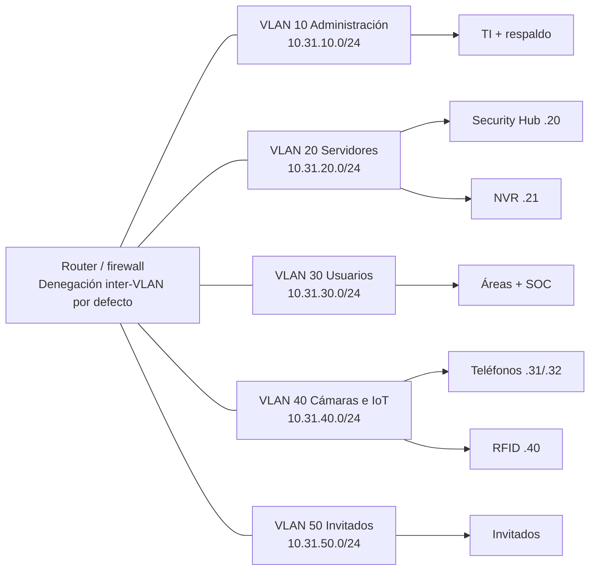

# VLAN y subredes

```mermaid
flowchart LR
    FW[Router / firewall<br/>Denegación inter-VLAN por defecto]
    V10[VLAN 10 Administración<br/>10.31.10.0/24]
    V20[VLAN 20 Servidores<br/>10.31.20.0/24]
    V30[VLAN 30 Usuarios<br/>10.31.30.0/24]
    V40[VLAN 40 Cámaras e IoT<br/>10.31.40.0/24]
    V50[VLAN 50 Invitados<br/>10.31.50.0/24]

    FW --- V10
    FW --- V20
    FW --- V30
    FW --- V40
    FW --- V50

    V10 --> TI[TI + respaldo]
    V20 --> HUB[Security Hub .20]
    V20 --> NVR[NVR .21]
    V30 --> USERS[Áreas + SOC]
    V40 --> CAMS[Teléfonos .31/.32]
    V40 --> READER[RFID .40]
    V50 --> GUESTS[Invitados]
```

Las líneas representan pertenencia, no permiso total. Las comunicaciones permitidas están en el diagrama de flujos y en la matriz ACL.
