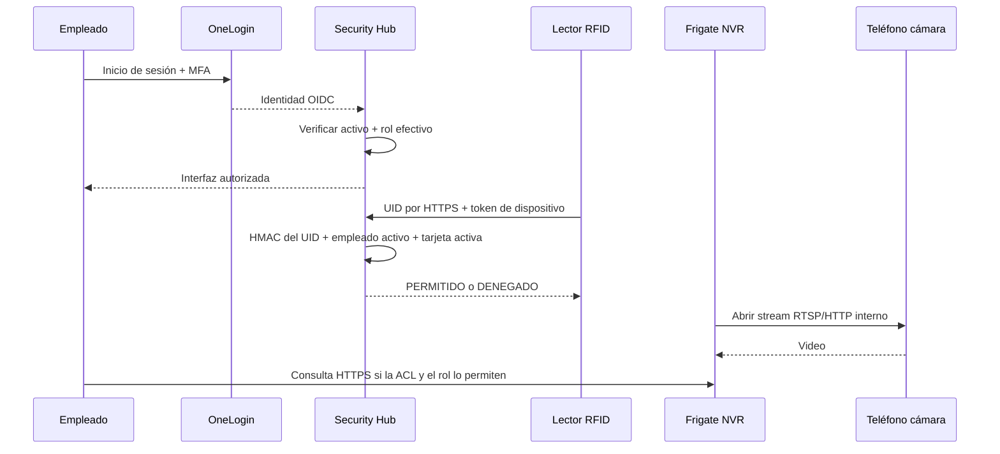

# Flujos de seguridad

```mermaid
sequenceDiagram
    participant E as Empleado
    participant O as OneLogin
    participant H as Security Hub
    participant R as Lector RFID
    participant N as Frigate NVR
    participant C as Teléfono cámara

    E->>O: Inicio de sesión + MFA
    O-->>H: Identidad OIDC
    H->>H: Verificar activo + rol efectivo
    H-->>E: Interfaz autorizada

    R->>H: UID por HTTPS + token de dispositivo
    H->>H: HMAC del UID + empleado activo + tarjeta activa
    H-->>R: PERMITIDO o DENEGADO

    N->>C: Abrir stream RTSP/HTTP interno
    C-->>N: Video
    E->>N: Consulta HTTPS si la ACL y el rol lo permiten
```

El UID no se almacena en claro. El Hub y el NVR no comparten base de datos. El dashboard DPO permanece fuera de estos flujos.
